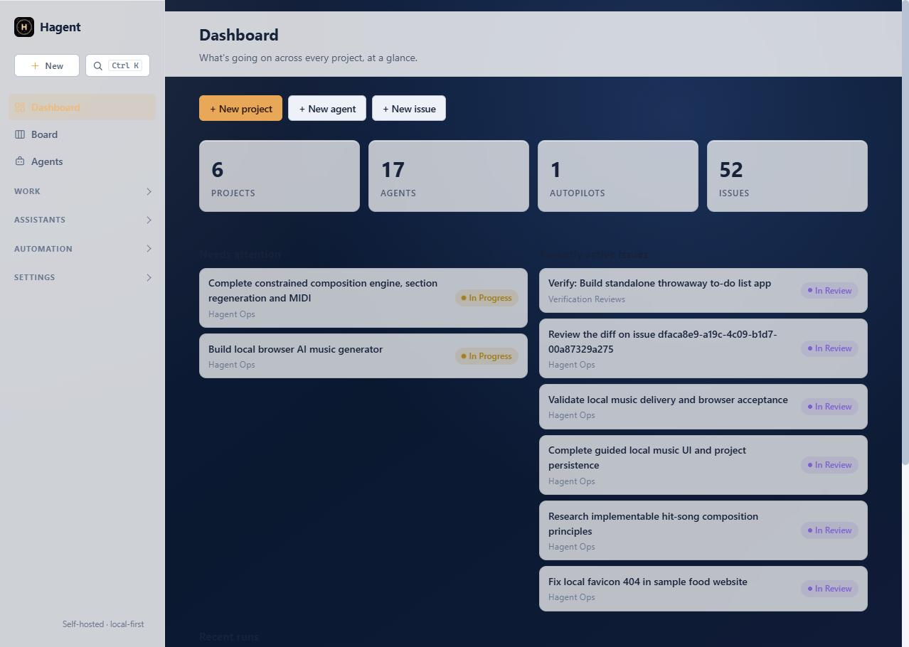
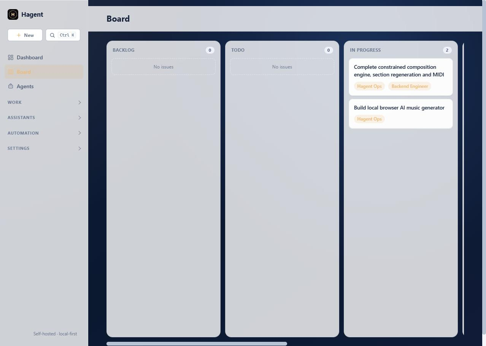
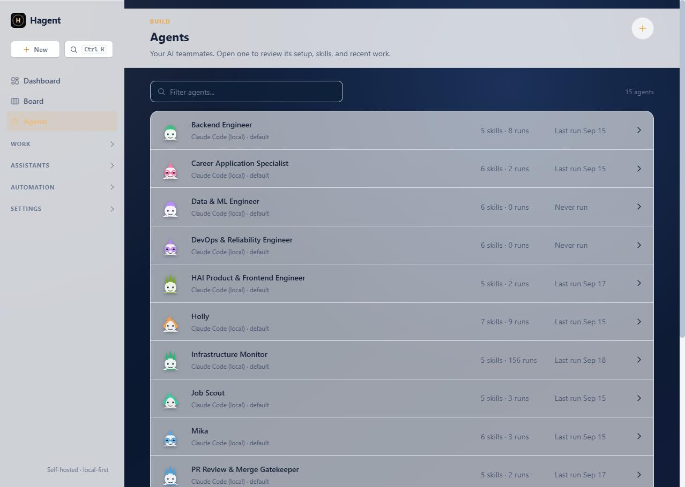

# Hagent

A self-hosted multi-agent orchestration platform: projects with **issues** (a kanban tracker), **agents** bound to pluggable **runtimes** (major cloud APIs, local Ollama/LM Studio, and installed AI CLIs), **squads** and **skills**, and **autopilots** that run agents against matching issues on a schedule — from a CLI or a web dashboard.

> Current release: **0.2.0**. Hagent is under active development and is best suited to local use and trusted small-team deployments. Read the security notes before enabling terminal access or exposing the server beyond localhost.

Hagent is a from-scratch reimplementation of the core ideas behind commercial multi-agent orchestration tools (Multica and similar): a workspace holding projects, issues, agents, and runtimes, with a clean adapter boundary so any AI backend can be plugged in without touching the rest of the system.

|                                              |                                        |                                          |
| -------------------------------------------- | -------------------------------------- | ---------------------------------------- |
|  |    |    |
| Dashboard                                    | Kanban board                           | Agent roster                             |

## Why this exists

Hagent is built to:
- Run entirely locally — no dependency on a hosted backend, own your data and workflow.
- Support any AI runtime interchangeably (cloud APIs or local models) behind one interface.
- Model work the way real orchestration tools do — issues with status/labels/properties/sub-issues/comments, not just a flat task queue.
- Preserve provider-neutral memory and make model-routing decisions auditable.

## Architecture

```
hagent/
  models.py       SQLAlchemy models for workspaces, issue extras, skills,
                   attachments, repos, autopilots, and MCP server bindings
  db.py           Engine/session setup (SQLite by default)
  adapters/       BaseRuntime interface + direct API, OpenAI-compatible, Ollama, Gemini, and CLI adapters
  engine.py       run_issue(): Issue -> Agent -> Runtime -> Run result
  scheduler.py    APScheduler cron runner: fires Autopilots against matching issues
  cli.py          click CLI mirroring Multica's noun/verb structure
  web.py          FastAPI + Jinja2 kanban dashboard
  templates/      Sidebar-nav'd dashboard: project boards, issue detail, squads/skills/autopilots/repos
```

Every runtime backend implements one method — `run(prompt, context) -> RuntimeResult` — so adding a new AI provider never touches the CLI, web layer, or task engine.

Hagent also includes a canonical provider-neutral memory service shared by
internal agents, Codex CLI, Claude Code, and MCP-compatible clients, plus an
auditable adaptive model router. See
[Unified memory and adaptive model routing](docs/unified-memory.md).

## Setup

```bash
git clone https://github.com/sudheer-050/hagent.git
cd hagent
python -m venv .venv
# Windows: .venv\Scripts\activate
# macOS/Linux: source .venv/bin/activate
python -m pip install --upgrade pip
pip install -r requirements.txt
pip install -e .
hagent serve
```

The dashboard is available at `http://127.0.0.1:8000`. API runtimes need the corresponding provider key; CLI runtimes reuse the CLI's existing local login. Ollama must already be running when an Ollama runtime is used.

Windows is the primary tested host. The web application is portable, but some terminal execution and local CLI discovery paths are Windows-oriented and need broader macOS/Linux verification.

Local state is stored in `hagent.db` and is intentionally ignored by Git. Cloning the repository installs the application but does not copy another installation's users, agents, credentials, issues, memory, or run history.

### Security before first use

- Keep the default `127.0.0.1` binding unless accounts are configured and traffic is protected with HTTPS or a private network.
- Terminal-enabled agents run with the permissions of the operating-system account running Hagent.
- An agent's terminal starting directory is a working directory, **not a filesystem sandbox**; absolute paths and directory changes can reach other files allowed to that OS account.
- Run approval pauses an agent before a run starts. It is not per-command approval after the run begins.
- For autonomous terminal work, prefer a dedicated OS account, container, virtual machine, or isolated worker device.

## CLI usage

```bash
hagent runtime create --name local-ollama --type ollama --model qwen3-fast8b
hagent agent create --name Researcher --runtime <runtime-id>
hagent project create --name "Website Revamp"
hagent issue create --project <project-id> --title "Ping the agent" --description "..." --assignee <agent-id>
hagent issue rerun <issue-id>              # run the issue's assigned agent now
hagent squad create --name Ops && hagent squad member add <squad-id> --agent <agent-id>
hagent skill create --name Terse --content "Always answer in one word." 
hagent autopilot create --name "Todo runner" --agent <agent-id> --project <project-id> --filter-status todo
hagent autopilot trigger-add <autopilot-id> --cron "*/5 * * * *"
hagent daemon start                         # run the autopilot scheduler in the foreground
```

### Running projects with agents

Assigning work starts the agent. A dispatcher (in the server, or `hagent daemon start`) picks up queued
runs every few seconds and respects each agent's `max_concurrent_tasks` (default 1), starting `urgent`
and `high` priority issues first. `HAGENT_MAX_PARALLEL_RUNS` caps runs across all agents (default 8).

```bash
hagent issue create --project <p> --title "Add login" --assignee Coder --status todo --priority high --due-date 2026-10-01
hagent issue assign HAG-12 --agent Reviewer            # starts the agent; add --no-start to only assign
hagent issue status HAG-12 todo                        # moving into todo/in_progress starts the assignee too
hagent issue list --status todo --priority high --sort priority --limit 20
```

* Issues get per-workspace keys (`HAG-12`, prefix from the workspace name or `issue_prefix`); every command that
  takes an issue id also takes its key.
* **Stages:** sub-issues created with `--parent P --stage N` form a barrier group. When every issue in a stage is
  finished (in review, done or cancelled) the parent's agent gets a run summarising that stage, and decides what
  happens next. Sub-issues without a stage never wake the parent. `issue children` groups them by stage.
* **Recurring work:** `hagent autopilot create --mode create_issue --project <p> --description "..." --issue-title-template "Report {{date}}"`
  creates a fresh issue and starts the agent on every trigger. `trigger-add --cron ... --timezone Asia/Kolkata` fires in that zone.

### Accounts and using Hagent from other devices

By default Hagent serves only this machine and needs no login. Creating the first account turns sign-in on for everything,
including this machine.

```bash
hagent auth user-create sudheer                  # first account becomes the owner
hagent serve --host 0.0.0.0 --ssl-certfile c.pem --ssl-keyfile k.pem     # refuses non-local hosts until an account exists
hagent auth token-create --user sudheer --name laptop                    # shown once
# on the other device:
python -m hagent remote login --url https://host:8000                    # every python -m hagent command now runs on the server
```

Treat a login or token as shell access to the host: agents with terminal access can run commands as your Windows account. Serve over HTTPS or a private
network (Tailscale); Hagent does not encrypt traffic itself. File-path arguments of remote commands refer to the server.
`HAGENT_LOCAL=1` runs a command on the local machine instead.

**Worker devices** let an agent run on another machine's own `claude`, `codex`, `opencode`, `agy` or `gemini` login:

```bash
hagent auth token-create --user sudheer --kind worker --name laptop     # on the server; the name is the worker's identity
hagent worker start --name laptop --url https://host:8000               # on the laptop (add --allow-terminal to let agents run commands there)
hagent runtime create --name laptop-claude --type claude_code --model default --config '{"worker": "laptop"}'
```

The worker decides what runs on it: only those installed assistants, using its own executable and `--workdir`, never a path
or command sent by the server. Runs on a worker have no Hagent tools or delegation (the assistant uses its own tools).

### Speed

The database runs in WAL mode with `synchronous=NORMAL` (a commit costs ~0.01 ms instead of ~6 ms). After an OS crash or power
loss the last few transactions can be lost; the file stays consistent. Set `HAGENT_SQLITE_SAFE=1` to keep SQLite's defaults.
Back up `hagent.db` together with its `-wal` file, or use `sqlite3 hagent.db ".backup out.db"`.

### Project resources, skill labels and pull requests

```bash
hagent project create --name App --repo https://github.com/acme/app
hagent project resource add <project-id> --url https://github.com/acme/app --label main
hagent project resource list|update|remove <project-id> [<resource-id>]
hagent skill label add|list|remove <skill-id> --label <label-id>
hagent issue pull-requests <issue-id> [--refresh]   # --refresh asks GitHub via gh
```

`hagent issue pr` records the PR it opens, so it shows up in `issue pull-requests`.

### opencode runtime

`--type opencode_cli` runs the installed `opencode` CLI. Models are `provider/model` ids from
`opencode models` (for example `ollama/llama3.2:latest`). Without terminal access enabled, opencode
is run with bash, edit and webfetch denied. On Windows the adapter uses the native `opencode.exe`
inside the npm package rather than the `.cmd` shim, so prompt text never passes through `cmd.exe`.

### Fast CLI (optional warm process)

`python -m hagent <command>` behaves exactly like `python -m hagent.cli <command>`, but can hand the
command to a background process that already has Hagent loaded (about 150 ms instead of about 900 ms).

```bash
python -m hagent warm start    # start the background process
python -m hagent warm status
python -m hagent warm stop
```

It listens on `127.0.0.1` only, and requests need a random token kept in `~/.hagent/warm.json`.
Commands silently take the normal path when no warm process is running, when the command would use a
different database, when the source has changed since it started, or for `daemon` and `warm` commands.

Run `hagent <noun> --help` for the full command set, including workspace/user profile,
issue search/timeline/metadata/subscribers, skill import/refresh/search, squad activity,
webhook triggers, repo checkout, attachments, and MCP server bindings.

## Starting and stopping

Hagent does not start itself and installs no background tasks. Start it when you want it:

```bash
python -m hagent serve                 # dashboard and API on http://127.0.0.1:8000, plus the run dispatcher and scheduler
python -m hagent daemon start          # or: only the dispatcher and scheduler, with no web server
```

On Windows, `launch_hagent.vbs` starts the local server without keeping a console window open. It does not install a system service or scheduled task.

**Closing it does not lose work.** Everything (issues, runs, agent memory, worktrees) is stored on disk. When Hagent
starts again it finds any run that was in progress when it closed, marks that attempt as interrupted, and queues a
continuation for the same agent, telling it to check the work already done and carry on rather than start over. An issue
interrupted three times in a row is set to `blocked` instead of retrying forever. Runs that were queued but not started
simply start. Recurring autopilot firings that fall while Hagent is closed are not replayed.

Open http://127.0.0.1:8000 for a kanban board per project, issue detail pages (status/assignee/labels/comments/run history), and list+create pages for agents, squads, skills, autopilots, and repos. Failed or cancelled runs can be retried from issue history with the original agent and prompt. Agents can optionally require approval before a run starts; pending requests appear in the Approvals inbox, and rejected runs are recorded without contacting the provider. The autopilot scheduler starts automatically with the web server and recovers queued runs that had not started before a restart.


## Runtime providers

The web runtime picker includes direct OpenAI, Anthropic Claude, Google Gemini,
xAI Grok, Mistral, DeepSeek, and Perplexity profiles; Groq, OpenRouter, and
Together model gateways; local Ollama and LM Studio; authenticated Gemini CLI,
Codex CLI, and Claude Code assistants; plus a custom OpenAI-compatible endpoint.

Each agent chooses its own primary runtime and may optionally choose a different backup runtime. If the primary raises an execution error (including exhausted quota, rate limiting, authentication failure, or provider/CLI unavailability), Hagent immediately retries the task once on the backup and records a `runtime_failover` event. Cancellation and successful model responses do not trigger a backup request.

Each provider and recommended model includes a best-use description. Ollama
recommendations are rated against the detected system RAM and NVIDIA VRAM.
Cloud model sizes do not consume local VRAM. Provider catalogs change often, so
the form always allows an exact custom model ID.

API subscriptions and consumer chat subscriptions are separate products for
most providers. API runtimes require a provider API key unless an environment
variable is configured. CLI runtimes reuse the CLI's existing local login.

## Squad delegation

Squad membership is executable, not just organizational. During issue
runs, tool-calling runtimes expose each non-archived squad peer as a delegation
tool. The supervisor sends a focused task to that peer in a separate context;
the peer's findings return to the supervisor for synthesis. Delegation stays
within the workspace, is capped at four nested agents to prevent cycles, and
cannot bypass a teammate's manual run-approval setting. Delegation start,
completion, failure, and budget-exhaustion events during issue runs are
recorded in the issue timeline. Each supervisor has a configurable per-run call
limit (default 8; 0 disables delegation; maximum 50), shared by nested agents.
This pattern requires a runtime that
supports function/tool calling; CLI-only assistants may still work as agents,
but cannot be invoked as delegated tools by this mechanism. Issue timelines also
show successful and failed delegated tasks and specialist results so the
supervisor's answer is auditable by the user.

Run history keeps provider-reported input/output token counts separately from
the local word-count estimate. OpenAI-compatible, Anthropic, Gemini, and Ollama
API responses are recognized, including every model turn in a tool-calling run;
CLI runtimes or providers that omit usage continue to show an estimate instead.
Issue runs launched in the web UI are persisted before background execution;
CLI and autopilot runs remain synchronous.

## Tests

```bash
pytest
```

## Release status and known limitations

Version 0.2.0 includes authenticated remote access, worker devices, provider failover and recovery, provider-neutral memory, adaptive model routing, worktree isolation, approvals, usage tracking, multi-file skills, squad delegation, and scheduled or webhook-driven Autopilots. Existing databases are upgraded additively on startup.

Current limitations:

- Hagent is a single-node SQLite application, not a horizontally scaled control plane.
- The terminal starting directory is not a hard containment boundary; use OS- or container-level isolation for untrusted autonomous work.
- Webhook endpoints are not publicly exposed automatically; use a trusted tunnel or reverse proxy when required.
- Marketplace-wide skill discovery is out of scope; local archives and supported direct URLs can be imported.
- The current test snapshot passes 282 tests, with 6 remaining failures in agent/skill presentation markup. Core orchestration, authentication, memory, routing, recovery, worker, and provider tests pass.
- Automated CI and packaged container deployment are not yet included.

See [CHANGELOG.md](CHANGELOG.md) for release details and [HANDOFF.md](HANDOFF.md) for contributor notes.

## Agent terminal access

Terminal access for AI agents is optional and disabled by default. Enable **Allow terminal commands** on an agent and choose its starting directory. API and local tool-calling models receive an audited `terminal_execute` tool. Codex CLI, Gemini CLI, and Claude Code use their native automation mode only when that checkbox is enabled. Commands and results are recorded as issue timeline tool calls. This permission can execute arbitrary commands with the Hagent process user's OS permissions; the configured starting directory does not prevent access to other permitted paths. Enable it only for trusted agents and prefer OS-level isolation.
